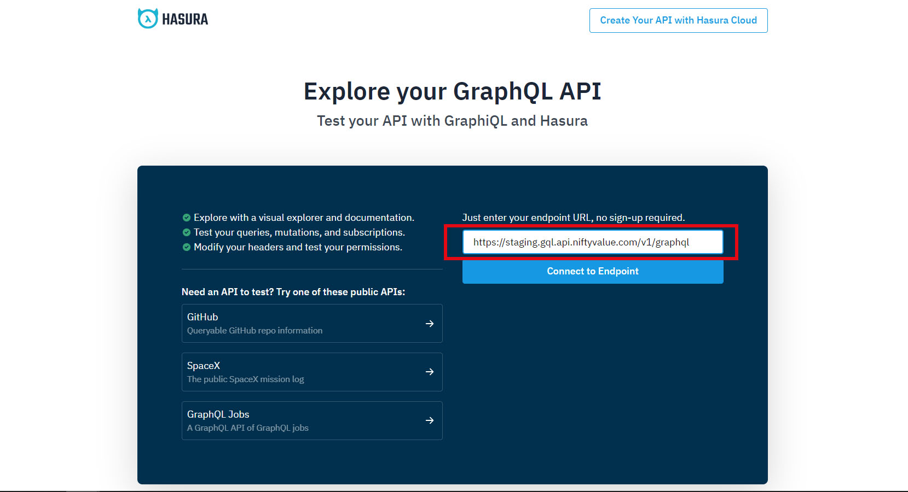
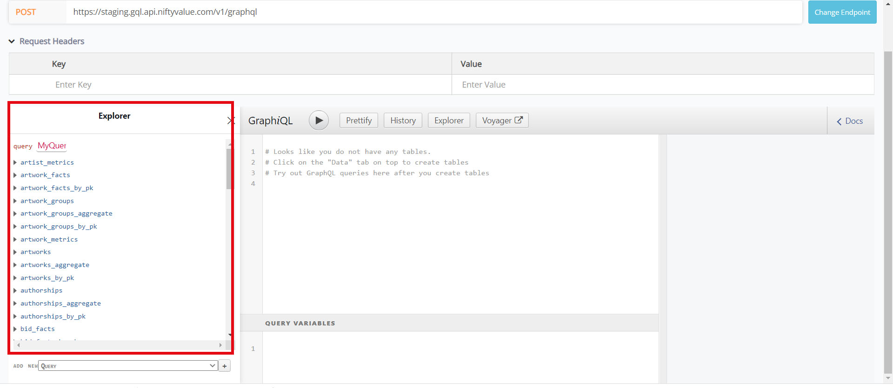
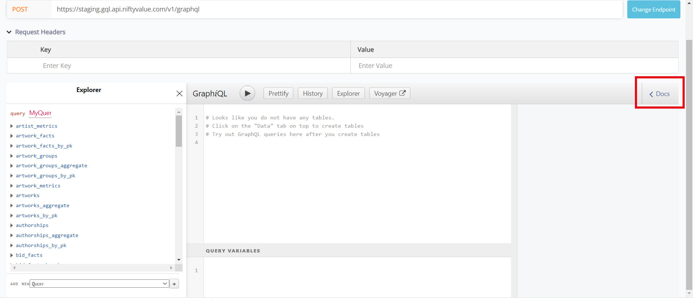
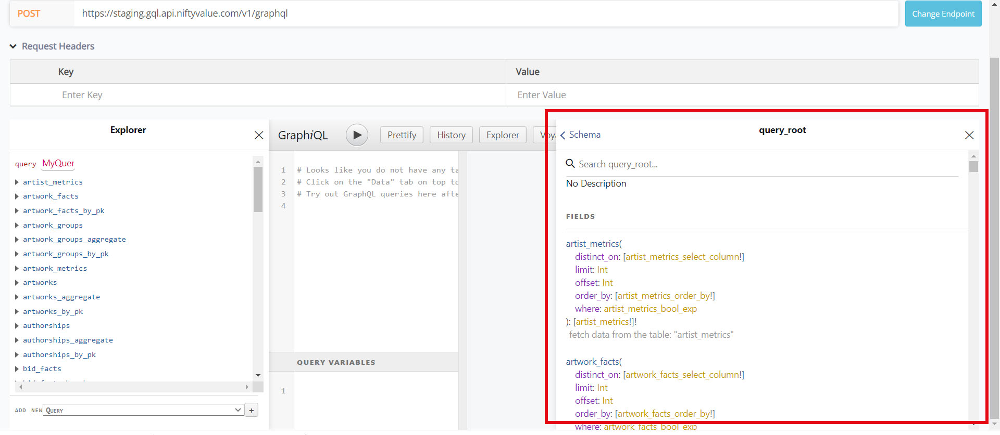
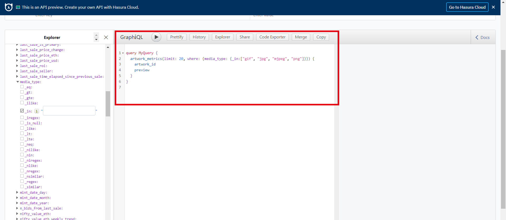
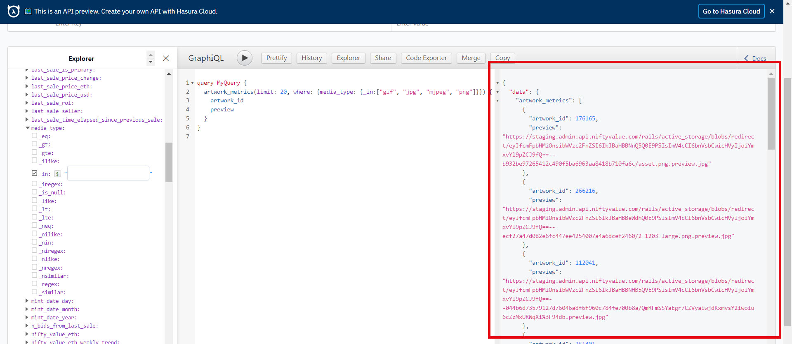

# NiftyEvalue Documentation 
https://www.niftyvalue.com/team
## Purpose 
NiftyEvalue has been developed for evaluating the recommender system made by [NiftyValue's team](https://www.niftyvalue.com/team). Their recommendation [algorithm](https://www.niftyvalue.com/method) measures low-level features similarity of images and returns NFTs artworks that represent users' preferences based on the ones they previously liked or disliked.
By interacting with the algorithm and answering some short questions about their attitudes and experience, we believe users will provide helpful information to understand how well the recommending system works from a human point of view.

## Research 
The first phase of our project consisted of literature research of previous case studies and evaluation of recommending systems. We tried to find systems that had similar functionalities to the one we were going to evaluate; thus, we focused on papers describing recommending systems based on low-level features similarity and centered on digital objects like images and music. 
We followed Avazpour [et al.] study's classification of the different dimensions used to evaluate a recommending system and we decided to focus our evaluation on a **user-centric** point of view.
Many studies in the field have started to recognize the beneficial effects of end-users involvement to measure dimensions related to the user's subjective perception of a system such as novelty, serendipity, and utility. 
Additionally, we detected two tools that were helpful in designing our evaluation:
* **ResQue's taxonomy**: by Pu et al., is a holistic study on user’s perceptions and impressions while interacting with a system;
* **Knijnensburg's framework**: Knijensburg et al. expand ResQue’s framework with context characteristics, employing personal and situational characteristics. This framework studies the objective qualities of the system, and the observable user behavior, under the light of the user’s subjective perception of the system.
For a deeper insight on our research please refeer to our [State of the Art document]()
## Design 

Following Knijnensburg, we decided to design our study as the triangulation of three main typologies of data:

1. **User characteristics**: gathered from surveys
2. **Subjective experience**: gathered from surveys
3. **Behavioral data**: gathered from log-data

**User characteristics**, the analysis of contextual characteristics introduced by Knijnensburg et al. in their framework, helped us consider the heterogeneity of people approaching NiftyEvalue and the differences in their education and attitude towards art and Blockchain. 
**Subjective experience** refers to the opinion of the users on their interaction with NiftyEvalue, we expect to gather information on the user experience by collecting their answers to the surveys. 
**Behavioral data** consists of the data automatically collected by the application, the user produces this data simply by interacting with the system. This information will be used to understand how the user actually behaves when using the system. 
This data can be later analyzed through a Structural Equation Model (SEM) analysis, this model allows us to quantify the relationships between variables in a system, and can give us a broader understanding of the various factors at play in our study.

### Tasks

Two tasks have been designed for the user to interact with NiftyValue’s recommending system.

The purpose of the first one, the *Warm Up task*, is to test the accuracy of the recommendation system, as well as familiarizing the users with our application. 
In the Warm Up task, the user is presented with a randomly selected reference image, and five images deemed similar by NiftyValue’s recommendation algorithm.
The user is asked to order the five images from the most similar to the less similar to the reference image, the results will help us understand how well the recommendation algorithm predicts human choices. 

The *Main task* consists of multiple browsing sessions in which the user can try out NiftyValue's elicitation system.
The user can like and dislike the displayed images and use this kind of elicitation system to find new artworks based on their choices, once they find aesthetically pleasing artworks they can place them in a dedicated space, the “dashboard”.
These activities in addition to the users’ feedback will allow us to gather data on the way the users interact with the elicitation system and their degree of satisfaction and enjoyment while using the application.

### Surveys 

For collecting personal data we designed a first survey to gather user characteristics before starting the experiment. At the end of each task, the user will submit their opinion on the experience through some additional forms. 

The first survey aims at collecting user's characteristics. Here we are concerned with the education and experience with art, finance, and technology. The table below shows the questions we have selected. 

| Question      | Answer input | Focus |
| ----------- | ----------- | ----------- |
| Do you work or have you worked in the traditional art world? | Multiple choiche checklist | Experience in the art world |
| Do you work or have worked with NFTs? | Multiple choiche checklist | Experience with NFTs |
| Do you work or have worked in finance and have experience with blockchain technologies? | Multiple choiche checklist | Experience in the finance world |
| How often do you use Multimedia Applications? | 5-points Likert scale (from "very often" to "never") | Experience with multimedia applications |
| It is hard for me to make plans. | 5-points Likert scale (from "strongly disagree to strongly agree) | Personal attitudes |
| I easily get bored. | 5-points Likert scale (from "strongly disagree" to "strongly agree") | Personal attitudes |
| I consider myself a curious person. | 5-points Likert scale (from "strongly disagree" to "strongly agree") | Personal attitudes |


The other surveys are submitted to the user after each task, as soon as she/he finishes it. We decided keep them as brief as possible with just 3 essential questions as listed below.

| Question      | Answer input | Focus |
| ----------- | ----------- | ----------- |
| On a scale from 1 to 5 how much satisfied are you after this task? | 5-points Likert scale | User satisfaction |
| Have you encountered one of the following issues?| Multiple choiche checklist | Issues with the algorithm |
| Do you have any additional comment? | Text | User's impressions |

In this phase, we have already defined the most important dimension for our evaluation, i.e., the user *satisfaction* with their experience. 
Users’ comments might be investigated through sentiment analysis (we advise Syuzhet, an R library trained in the English vocabulary, easy to learn and used for performing sentiment analysis on blogs' comments).
We also need to take into account the algorithm's misbehaviors, especially issues with the recommending algorithm (i.e. Recommending several instances of the same image). 
 
## Development

This section illustrates the development process. 

The website is structured into five main pages representing all the steps one has to follow to complete the experiment, plus a help page with links leading to NiftyValue's project website and the beta version of their application.

The header and navbar are not clickable as we do not want the user to freely browse our content, as it could compromise the experiment. Thus, **header** is composed by the application name and a button linking to the help page, while **navbar** works like breadcrumbs as to inform the user of their position in the application. 

### Api Queries 

To be able to display images and use the recommendation system we have to send several HTTP requests and manipulate the responses.
This is done via two different **API endpoint**: 
1.	The first to access a GraphQL database that contains data about artworks and the URLs of the images.
2.	The second is connected to the recommendation algorithm and we use it to obtain artworks identificatory numbers based on user preferences.

**Artwork data Endpoint (https://staging.gql.api.niftyvalue.com/v1/graphql)**

This API endpoint uses GraphQL [website](https://graphql.org/), an open-source data query and manipulation language for APIs to access the database where URLs and information about artworks are stored.
To obtain artworks data we need to send a POST request to the endpoint, we use Online GraphiQL [website](https://cloud.hasura.io/public/graphiql) a tool that allows us to explore the database structure and build a request in JSON format.


1.	We insert the API endpoint

2.	In the Explorer section, we can get an understanding of the structure of the database and the “fields” we can query

3.	We can use the Documentation Explorer to know the types and values that are allowed on the query fields.


4.	A GraphQL query in JSON format is built automatically, we can send it to see the response.


5.	The GraphQL query can be directly used in the JavaScript HTTP request.
We use this format to send the request in javascript:

```js
apiquery =  ` <graphQL query JSON> ` 
  fetch('<Artwork data API endpoint url>' , {
    method: 'POST',
      headers: {
        'Content-Type': 'text/json',
      },
      body: JSON.stringify({
        query: apiquery
      }),
    })
    .then((res) => res.json())
    .then((result) =>{ 
}

```

The “result” variable contains the response in JSON format.

**Image recommendation Endpoint (https://artdiscovery.api.niftyvalue.com/recs/api/v1.0/recs?artworks_pos=11,92&artworks_neg=7152)**

The recommendation algorithm takes as an input certain images that have been liked and disliked by a user and based on their low-level features selects the images in the database that are more similar to the liked ones and less similar to the disliked ones.
The second API endpoint access this system through a simple fetch request: in the URL sent to the endpoint the id of the liked images comes separated by a comma after the string “artworks_pos=” while the ids of disliked images come after “artworks_neg=”, in this example 11 and 92 are liked images, while 7 and 153 are disliked images:

```https://artdiscovery.api.niftyvalue.com/recs/api/v1.0/recs?artworks_pos=11,92&artworks_neg=7152```

We use this format to send the request in javascript:

```js
request = "<Second API endpoint URL>"; 
      ids = fetch(request)

      .then((response) => response.json())
      .then((result) => {
}

```

The “result” variable contains a list of 100 ids of images selected by the recommendation algorithm.

### Supabase [Chiara deve rivedere]
To set up the connection to Supabase, you need to create an account on their [website](https://supabase.com/) and sign-up. GitHub can be used for accessing it for the first time.

Then go on the project page and start a new project. 


After following all the steps for creating your project, you are provided with the url address of your project and the anon key for accessing it. 

To retrieve them click on your project and go to the settings as shown below.


The next step consists in preparing the connection on the HTML through a .js file.
First, we copied Supabase's CND 
 `<script src="https://unpkg.com/@supabase/supabase-js"></script>` in the &lt;head> tag of `FirstSurvey.html`, `warmUp.html` and  `Task.html`.

Each one of the listed HTML pages is connected to a JSON file linking it to the right table that we want to fill with the correspective data.

We created tables on Supabase web interface


Tables columns may be created and modified by clicking on their names as shown below. 


For example, `warmUp.html`'s survey results and log-data are managed by `supa_warmup.js`, in which, at line 3 we find this chunk of code:

`const supabase2 = createClient('project url', 'public anon key')`

The table in which the data is submitted, is here specified at the end of the code, at line 42:

`await supabase2.from('Warm_up').insert([submission])`

This is our standard procedure for adding data to Supabase, please feel free to modify it or connect the pages to your new project. 
      

### Homepage

**Page description**
The homepage file is **[index.html](https://github.com/Camillaneri/NiftyApp/blob/main/index.html)** here we present the application, providing information on NiftyValue, our experiment, how long it will keep to be finished and what will happen to the gathered data.

**Javascript description**
1. **scripts.js**
In this file, one can find a script in which a unique identifier is assigned to that user's session. <br>
The identifier is a string composed as follows: the actual date composed as DD/MM/YYYY concatenated as a string with a number N randomly chosen between 0 and 200. The final form is *DDMMYYYYN*. 
The function reveal() creates the effect of elements appering on the page while the user scrolls down.

### First survey
**Page description**
In this file, we built the first survey submitted to the user in a *pre-experimental* phase. <br>
The page is composed of a form contatining the questions listed in *[Design]()*. 
Questions from 1 to 3 have a check-list input, question 4 utilises a radio-button as input, and the last three questions consist of sliders for selecting a Likert scale value from 1 to 5. 

**Javascript description**
1. **FirstSurvey.js** contains jQuery code for the survey form, e.g., some code to block the submit button until all the check-lists and radio-buttons input groups have not been filled-up. 
2. **supa_survey1.js** is devolved to posting on the respective table on Supabase, the answers given by the user on this second page.

**Supabase data**
The table on Supabase related to the first survey is composed as follows:

| Column name   | Data type | Description |
| ----------- | ----------- | ----------- |
| Id          | int8        | User's unique identifier |
| ArtExp      | text        | User's experience in arts? |
| NftExp      | text        | User's experience with Non-Fungible Tokens |
| FinBcExp    | text        | User's experience in finance and with blockchain |
| useMM       | text        | How much time does the user spend on multimedia applications |
| Decision    | int8        | How indecisive is the user |
| Bore        | int8        | Hoe easily gets the user bored |
| Curios      | int8        | How curious is the user |

### Warm up
The Warmup Task page is composed by a reference image in the upper left area of the page, that is randomly picked artwork. Th Five similar images are selected by the algorithm and displayed in the lower right area of the page are images selected by the recommendation algorithm to be similar to the reference image. These are the ones the user must rank by similiarity. This action will be performed by This action will be performed by inserting images in the five numbered slots on the upper area of the page.

The Repeat Task button, when clicked restarts the task with new images, while the End Task button ends the tasks Warmup Task Functions definitely.

**Warmup Task Functions**
Here are described only the main functions of the Warmup Task page:
1. **WUfunctions.js** contains the jQuery function to display the tutorial when the page is loaded.
2. **WUrequests.js** contains functions connecting to NiftyValue's API, for filling the application, and for creating log data.
  * **loadWarmUp()** this function fetch a random image and 5 similar images for the Warmup task. It also contains some strings of code for creating counts and disctionaries, namely the log data for keeping track of reference image and similar images' ids loaded at each round 
  * **repeatask()** and **repeatask()** register the total amount of time needed to complete a round and the dictionaries containing the order of images decided by the user
3. **supa_warmup.js** is devolved to posting on the respective table on Supabase, the log data and answers given by the user in the survey at the end of Warm Up.

**Supabase data**
The table on Supabase related to the Warm Up page is composed as follows:

| Column name   | Data type | Description |
| ----------- | ----------- | ----------- |
| Id          | int8        | User's unique identifier |
| refID       | json        | json containing round numbers as key and the id of the reference image as values |
| AIorder     | json        | json containing the number of round as key and the images’ ids ordered by similarity by the algorithm  as value |
| UserOrder   | json        | json containing the number of round as key and the images’ ids ordered by similarity by by the user as values |
| TimeXround | json         | json keeping track of the time in (ms) needed for each round |
| Satisfaction| int8        | value of satisfaction level given by users |
| Issues      | text        | list of possible issues with the algorithm |
| Comments    | text        | additional comments by user |


### Task

The Main Task page is primarly composed by the Gallery, the central part of the page, it displays 20 random artworks.  Likes Box and Dislikes Box are the two sections above, when users click on the like or the dislike icon below every image, the artworks are displayed there. The Apply button positioned under the Likes Box and Dislikes Box, when clicked on displays 20 new images in the Gallery. The images are choosen basing on the images liked and disliked by the user in that elicitation session. The Reset button is positioned under the Likes Box and Dislikes Box, when clicked on cleans the Likes Box and Dislikes Box.
The Dashboard is a section on the left side of the window; it contains five slots where users can pin artworks they like, by clicking on the pin icon on the upper part of each image.
The Repeat Task button is positioned on the upper part of the dashboard, when clicked on reset the gallery and clean the dashboard. Finally, next to it there is the End Task button is positioned on the upper part of the dashboard, when clicked on ends the task.


**Main Task Functions**
Here are described only the main functions of the Main Task page:
1.	**TaskTutorial.js** Contains the jQuery function to display the tutorial when the page is loaded.
2. **task.js** contains functions connecting to NiftyValue's API, for filling the application, and for creating log data.
  *	**fill_task_dash()** This function is called when the main task page is opened but also by the Repeat Task and End Task button, it cleans the Gallery, the Likes Box, Dislikes Box, and the Dashboard and fetches 20 random images to fill the Gallery. It contains code for registering task's starting time and image added t the gallery.
  *	**AddLiked_Disliked()**This function manages the addition of liked and disliked images in the right box when the like or dislike icons beside images are clicked on. 
  *	**Apply_like_dislike()**This function takes the ids of liked and disliked images and fetches the resulting recommended images to fill the gallery. It contains log-data on time keept to send a query after images are loaded, updated the number of queries, registers negative and positive images of that query.
  * **display_img()** gathers high_quality version of the selected image and updates displayed imsges count in the log data.
  * **myImgsListener()** retrieves My Gallery images ids and counts. 
  *	**Addtodash()** If the user clicks on the pin icon beside an image this function displays the image on the first empty slot in the Dashboard.
  *	**repeaTask()** and **resetTask()** register the total amount of time from the begiinning of the task and when the clicked button is repeated.
3. **supa_task.js** is devolved to posting on the respective table on Supabase, the log data and answers given by the user in the survey at the end of the main task.

**Supabase data**
The table on Supabase related to the main task page is composed as follows:

| Column name   | Data type | Description |
| ----------- | ----------- | ----------- |
| Id          | int8        | User's unique identifier |
| n_queries       | int8        | Total number of queries performed by the user |
| queries_ids     | json        | Positive and negative inputs for each query sent by the user |
| myImgIds   | json        | String containing the ids of the images saved in the gallery at the end of the main task |
| myGallery_count   | json        | Count of total images in the personal gallery at the end of main task |
| displayedImgs   | json        | Count of enlarged images |
| TimeXround | json         | json keeping track of the time in (ms) needed for each round (when repeat button is clicked) |
| TimeXquery | json         | json keeping track of the time in (ms) needed for each query |
| Satisfaction| int8        | value of satisfaction level given by users |
| Issues      | text        | List of possible issues with the algorithm |
| Comments    | text        | additional comments by user |


### End page

**Page description**
A simple pages that thanks the users for their contribution.
It provides links to the official website of NiftyValue and to the beta version of the official application.